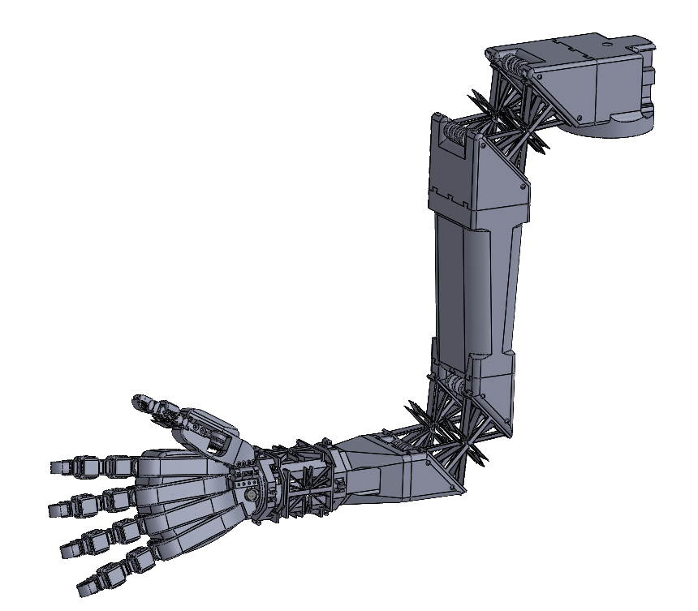
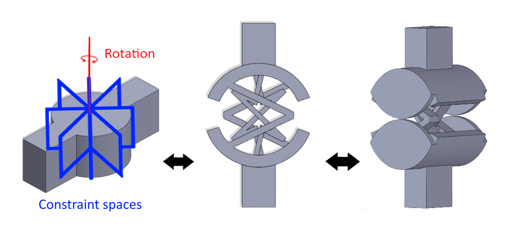
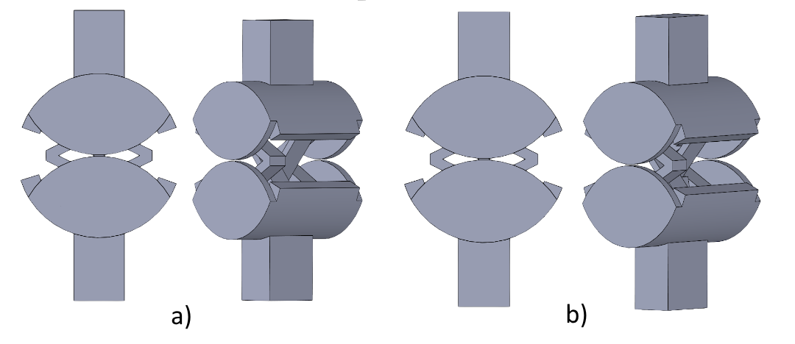
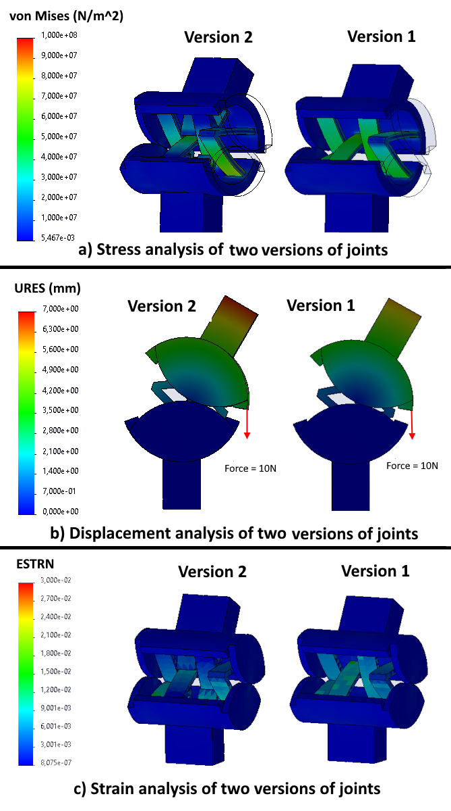
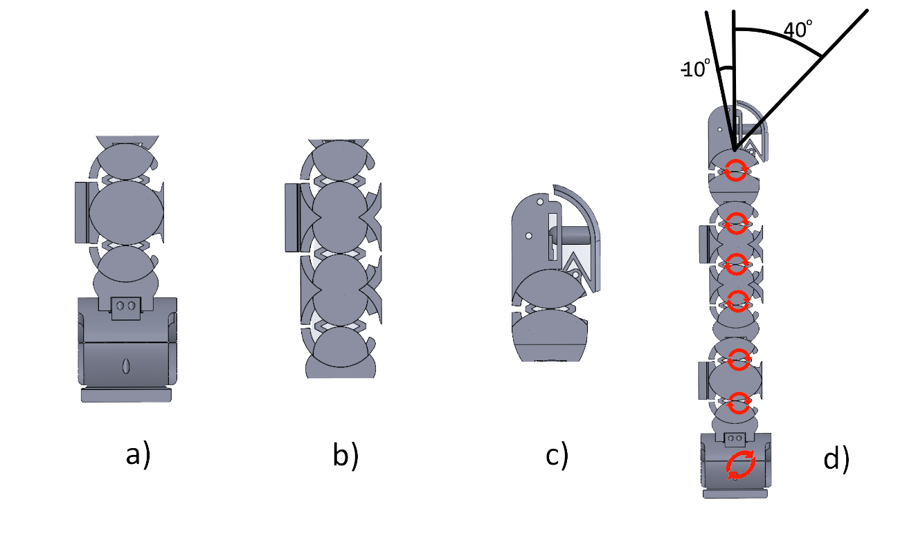
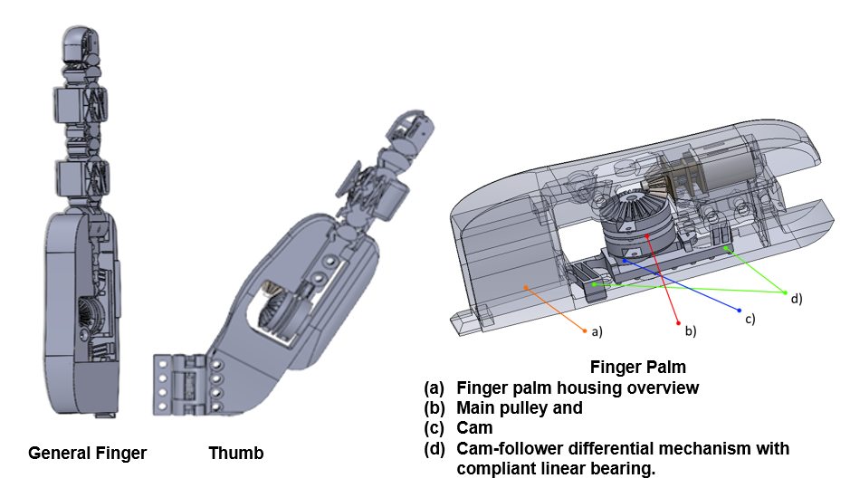
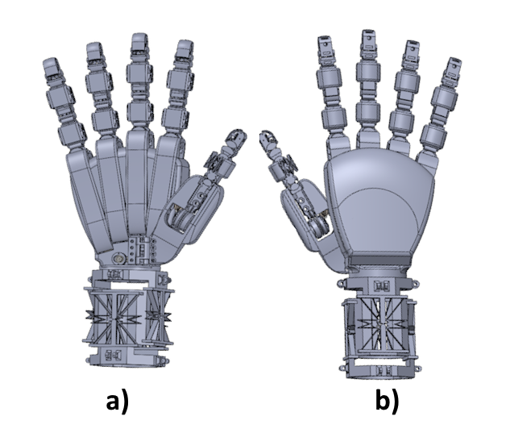
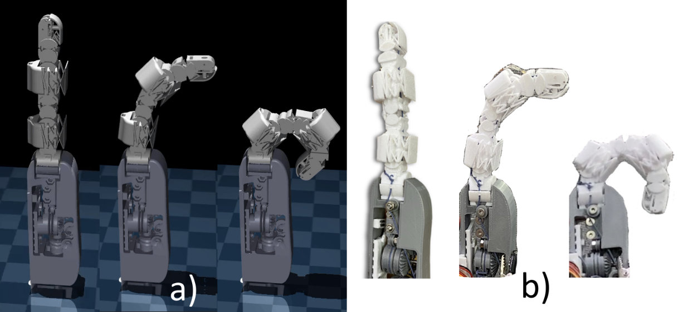
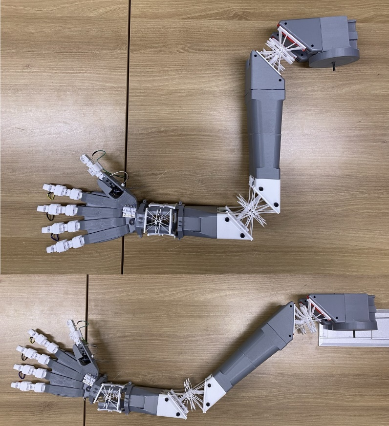

# Monolithic Robotics

**A compliant mechanism framework for anthropomorphic robot design — from a single joint to a full arm, printed in one piece.**

[](https://dcollection.skku.edu/srch/srchDetail/000000181091?localeParam=en)
[](https://ieeexplore.ieee.org/document/10773068)
[](docs/umobic-finger-technical-report.pdf)
[](LICENSE)

---

## The Core Idea

Most robotic arms are built from a collection of rigid links, discrete motors, and separate joints — each component manufactured and assembled independently. This approach works, but it carries real costs: mechanical complexity, assembly error, maintenance overhead, and a fundamental disconnect from how biological limbs actually move.

This framework starts from a different premise: **what if the entire structure — every joint, every link, every flexure — was one continuous compliant body?**

The answer is Monolithic Robotics. Every joint in this framework is derived from a single atomic unit: the **UMoBIC joint**, a two-flexure cross hinge with an embedded rolling contact element, synthesized from synovial joint biomechanics using the [FACT framework](https://samueli.ucla.edu/people/jonathan-hopkins/) developed by Prof. Jonathan Hopkins at UCLA. The same joint, stacked and scaled, produces every degree of freedom from fingertip to shoulder — and the entire assembly can be fabricated in a single 3D printing session.

> *"Our future work aims to design and create monolithic structures that mimic human anatomy and dexterity — including the integration of sensors embedded in the joints — creating anthropomorphic limbs in a single print session."*
> — Galvis Giraldo, ICCAS 2024

---

## From One Joint to a Full Arm

The framework is built on a single insight: the human synovial joint is **scale-invariant**. The same rolling contact + compliant flexure principle governs every joint in the body — from the distal interphalangeal joint of the finger (a few millimeters) to the shoulder (tens of centimeters). By matching this biology, one joint design becomes a universal building block.

```
UMoBIC Joint  (atomic unit, 1-DOF compliant revolute)
    │
    ├── × 2 stacked     →  MCP joint   (finger base)
    ├── × 3 stacked     →  PIP joint   (finger middle)
    ├── × 1             →  DIP joint   (fingertip)
    ├── × 4 universal   →  Wrist       (2-DOF)
    ├── scaled 50mm     →  Elbow       (1-DOF)
    └── scaled 70mm     →  Shoulder    (1-DOF)
```

The result: a full anthropomorphic arm with 6 degrees of freedom at the arm level, 7 per finger, and 5 for the thumb — all derived from the same joint geometry, fabricated as one monolithic structure.

<div align="center">
  
  <br><em>Monolithic Anthropomorphic Arm — CAD overview. Shoulder, elbow, wrist, hand and fingers as one continuous structure.</em>
</div>

---

## The UMoBIC Joint

The joint is the foundation of everything. It was designed using the **six-step FACT synthesis process**, beginning from the geometry of a human synovial joint and working through freedom and constraint topology analysis to arrive at a manufacturable compliant structure.

<div align="center">
  
  
  <br><em>UMoBIC joint — Version 1 (left) and Version 2 (right), each with embedded contact rolling element. Version 2 reduces peak stress by 15.25% and increases range of motion.</em>
</div>

**Key properties (PETG, 10N load):**
| Property | Version 1 | Version 2 |
|---|---|---|
| Peak stress | 6.8 × 10⁷ N/m² | 5.9 × 10⁷ N/m² |
| Max displacement | 6.073 mm | 6.673 mm |
| Max strain | 1.488 × 10⁻² | 1.167 × 10⁻² |
| Range per joint | ~40° | ~40° |
| Stress threshold | 60 MPa | 60 MPa |

The embedded **contact rolling joint** solves the cable compression problem: cable-driven systems exert axial compressive loads on flexure blades during actuation, accelerating fatigue. The rolling contact surface redistributes these loads through rolling rather than sliding, dramatically extending durability.

<div align="center">
  
  <br><em>Finite Element Analysis — von Mises stress (a), displacement (b), and strain (c) for both joint versions.</em>
</div>

---

## Serial Stacking — How One Joint Becomes a Finger

A single joint provides ~40° of flexion. Human finger joints require 70°–110°. The solution is serial stacking: flexures in series combine their degrees of freedom, and the cumulative range matches biological targets without changing the joint design.

<div align="center">
  
  <br><em>MCP (a), PIP (b), DIP (c), and full finger with 7 DOF (d). Red circles mark each degree of freedom.</em>
</div>

| Phalanx | Joint | Stacking | DOF |
|---|---|---|---|
| Proximal | MCP | 2 joints + 1 offset 90° | 3 |
| Middle | PIP | 3 joints | 3 |
| Distal | DIP | 1 joint | 1 |
| **Total** | | | **7** |

---

## The UMoBIC Finger

The finger is the first complete implementation of the framework — every mechanism in it was also designed using FACT: the skin modules, the fingertip force transmission, and the differential actuation system.

<div align="center">
  
  <br><em>UMoBIC-Finger internal structure: cable-driven system, cam-follower differential mechanism, skin modules, and fingertip force transmission.</em>
</div>

**Design summary:**
- 7 degrees of freedom (6 flexion/extension + 1 abduction-adduction)
- Two grasping modes: full underactuated wrap + independent tip control
- Integrated skin modules (4-DOF compliant surface)
- Fingertip force transmission to FSR-400 sensor (0–10 N range)
- Cam-follower differential mechanism for independent DIP control
- Single print session, standard PETG, any desktop FDM printer
- **~85 grams, ~$8 USD** including actuators and sensors

---

## Hand and Wrist

The same joint, extended with larger redundant flexure blades, produces the wrist mechanism — a 2-DOF universal joint configuration. Five UMoBIC fingers plus an opposable thumb assemble into the full anthropomorphic hand.

<div align="center">
  
  <br><em>Modular anthropomorphic hand — dorsal (a) and palmar (b) views. Fingers and thumb attach via snap-fit connections secured with M3 screws.</em>
</div>

---

## Simulation and Kinematics

The finger's cable-driven, underactuated design produces highly nonlinear kinematics — cable elasticity and friction prevent purely analytical modeling. Two approaches were compared:

- **Continuum robotics model**: accurate at low angles, diverges at high angles
- **LSTM neural network**: trained on motion capture data, R² = 0.9998 across full range

<div align="center">
  
  <br><em>MuJoCo simulation (a) vs real prototype (b) — three poses across the range of motion.</em>
</div>

The LSTM model serves as a **joint angle observer**, estimating the motor pulley angle θ required for a given fingertip position (x, y). This feeds an impedance controller for compliant force control during grasping.

---

## Prototype

<div align="center">
  
  <br><em>Physical prototype — monolithic anthropomorphic arm with hand, two poses. Fabricated with PETG and PLA on desktop FDM printers.</em>
</div>

---

## Repository Structure

```
monolithic-robotics/
├── docs/
│   ├── umobic-finger-technical-report.pdf   ← Full joint & finger design document
│   └── images/                              ← Design figures
├── joint/
│   └── cad/                                 ← UMoBIC joint CAD files (v1 and v2)
└── README.md
```

**Related repositories:**

| Repo | Description |
|---|---|
| [open-yta-hand](../open-yta-hand) | Full implementation: finger → hand → wrist. Control code, firmware, MuJoCo, LSTM IK, motion capture |
---

## Publications

**Master's Thesis** — Sungkyunkwan University, 2024
> *Monolithic Robotics with Cognitive AI: A Compliant Mechanism-Based Anthropomorphic Arm Design for Semantic Autonomous Manipulation*
> Gilberto Galvis Giraldo
> [[SKKU Repository]](https://dcollection.skku.edu/srch/srchDetail/000000181091?localeParam=en)

**ICCAS 2024**
> *Design of a Modular Anthropomorphic Hand with Integrated Monolithic Compliant Fingers and Wrist Joint*
> Gilberto Galvis Giraldo, Arpan Ghosh, Tae-Yong Kuc
> 24th International Conference on Control, Automation and Systems, Jeju, Korea
> doi:10.23919/iccas63016.2024.10773068

**Technical Report** — 2026
> *UMoBIC-Finger: An Underactuated Monolithic Bio-inspired Compliant Robotic Finger*
> Gilberto Galvis Giraldo
> [[PDF]](docs/umobic-finger-technical-report.pdf)

---

## Foundation

The joint synthesis methodology builds on the **FACT framework** (Freedom, Actuation and Constraint Topologies) developed by Prof. Jonathan Hopkins at UCLA. FACT provides a geometric, visual approach to designing parallel flexure systems with specified degrees of freedom.

> Hopkins, J.B. and Culpepper, M.L. — *Synthesis of multi-degree of freedom, parallel flexure system concepts via freedom and constraint topology (FACT)*, Precision Engineering, 2010.

---
## 🔧 Work in Progress — Project Tumbaga

*Tumbaga* is a parametric design generator for FACT-based compliant joints and flexure chains,
currently under active development as part of this framework.

Named after the gold-copper alloy mastered by pre-Columbian Muisca and Quimbaya goldsmiths —
a material that is neither pure gold nor pure copper, but stronger and more workable than either —
Tumbaga reflects the same idea: combining geometric theory (FACT) with practical fabrication
constraints to produce something more useful than either alone.

**What it does:**
Given a set of design requirements, Tumbaga outputs a print-ready STL of a compliant joint or
flexure chain — no CAD software required:

- Degrees of freedom (1-DOF revolute, 2-DOF universal, translational, or combined)
- Target range of motion per joint
- Physical dimensions (length, width, and scale)
- Motion axis orientation
- Material selection (PETG, PLA, TPU) with automatic stress threshold validation

The output is a fully parametric, FEA-informed geometry ready to send directly to any
standard FDM printer — closing the loop between the FACT synthesis methodology documented
in this repository and a physical prototype.

> **Status:** Active development. Not yet released.
> Follow this repository for updates.
---
## Author

**Gilberto Galvis Giraldo**
M.Sc. Electrical and Computer Engineering — Sungkyunkwan University, South Korea

---

## License

MIT License — see [LICENSE](LICENSE) for details.
